# INDICE
1. [Introduzione](#Introduzione)
2. [Modello di dominio](#Modello-di-dominio)
3. [Requisiti specifici](#Requisiti-specifici)
    - [Requisiti funzionali](#Requisiti-funzionali)
    - [Requisiti non funzionali](#Requisiti-non-funzionali)
4. [System Design](#System-Design)
    - [Stile architetturale adottato](#Stile-architetturale-adottato)
    - [Diagramma dei package](#Diagramma-dei-package)
    - [Diagramma dei componenti](#Diagramma-dei-componenti)
    - [Commenti](#Commenti-SD)
5. [OO Design](#OO-Design)
    - [Diagrammi delle classi e diagrammi di sequenza](#Diagrammi-delle-classi-e-diagrammi-di-sequenza)
    - [Design pattern utilizzati](#Design-pattern-utilizzati)
    - [Commenti](#Commenti-OO)
6. [Riepilogo del test](#Riepilogo-del-test)
7. [Manuale utente](#Manuale-utente)
8. [Processo di sviluppo e organizzazione del lavoro](#Processo-di-sviluppo-e-organizzazione-del-lavoro)
9. [Analisi retrospettiva](#Analisi-retrospettiva)
    - [Soddisfazioni](#Soddisfazioni)
    - [Insoddisfazioni](#Insoddisfazioni)
    - [Cosa ci ha fatto impazzire](#Cosa-ci-ha-fatto-impazzire)


# Introduzione
**SCACCHI** è una applicazione interattiva di gioco degli ***scacchi*** (*SNA*) sviluppata su Java e giocabile tramite interfaccia a linea di comando.

[***Il gioco degli scacchi***](https://it.wikipedia.org/wiki/Scacchi) è uno dei giochi più antichi, affascinanti e popolari al mondo.

[***FIDE***](https://www.fide.com/) è il sito web della Federazione internazionale degli scacchi, la principale organizzazione mondiale del gioco degli scacchi, che organizza campionati mondiali e che regolamenta il gioco.

Il nostro gioco è basato su una matrice 8x8 che rappresenta le 64 case di una scacchiera.


L'applicazione permette di giocare seguendo la [notazione algebrica](https://it.wikipedia.org/wiki/Notazione_algebrica) abbreviata degli scacchi.

L'esecuzione dell'applicazione è possibile attraverso linee di comando via [Docker](https://hub.docker.com/).

L'interazione avviene attraverso un'interfaccia disegnata su linea di comando, dove la ***scacchiera*** viene opportunamente disegnata, indicando anche lettere e numeri di colonna, per permettere all'utente di giocare agevolmente.

Oltre alla possibilità di specificare i diversi movimenti tramite la notazione algebrica, il programma permette all'utente di accedere a diverse funzioni aggiuntive.
Il comando *moves* permette all'utente di visualizzare tutti i movimenti della partita finora avvenuti, permettendo quindi di consultare lo storico della partita. <br>

Il comando *captures* invece fornisce all'utente una lista contenente tutte le catture avvenute fino a quel momento.


**SCACCHI** è figlia del corso di INGEGNERIA DEL SOFTWARE tenuto dal [*Professore Filippo Lanubile*](http://www.di.uniba.it/~lanubile/) nell'Anno Accademico 2019-2020, dal gruppo ***wilkinson*** composto da:
- [Gianluca Laera](https://github.com/gian01pie)
- [Stefano Lozito](https://github.com/stefanolozito)
- [Vincenzo M.G. Martemucci](https://github.com/raimondoDiSangro)
- [Andrea Perruggini](https://github.com/Perru21)
- [Nicola Ragone](https://github.com/nicolara96)
- [Giuseppe Sancesario](https://github.com/Giuseppe199925)
- [Pierpaolo Ventrella](https://github.com/pventrella20)
 <br>


<br> <br>
[Torna all'indice...](#Indice)

# Modello di dominio


<br> <br>
[Torna all'indice...](#Indice)

# Requisiti specifici

### Requisiti funzionali
_______________
#### ***>>>>> [SPRINT 1] user stories <<<<<***
_______________
#### 1) CREARE ELENCO COMANDI
  ***Scopo:*** visualizzare elenco dei comandi
  ##### CRITERI DI ACCETTAZIONE
  - eseguendo il comando  
  	[ ***>help*** ]  
  - il risultato è una lista di comandi (uno per riga)
  
  <center>
	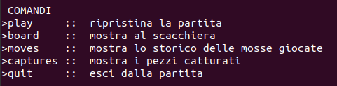
</center>

  > - **esempio comandi**:  
  > *>board*,  
  > *>import*,  
  > *>export*,  
  > *>quit*,  
  > *...*  
_______________
#### 2) INIZIARE UNA NUOVA PARTITA
  ***Scopo:*** permettere all'utente di interfacciarsi ad una partita
  ##### CRITERI DI ACCETTAZIONE
  - eseguendo il comando  
  	[ ***>play*** ]  
  - l'applicazione si predispone a ricevere la prima mossa di gioco
  
  <center>
	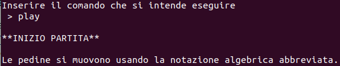
</center>

  > - il sistema è in grado di ricevere altri comandi in questo stato, ad esempio  
  > *>mostra scacchiera*,  
  > *>annullare*,  
  > *...*
  > - è possibile iniziare una nuova partita anche a partita già in corso
_______________
#### 3) CHIUDERE IL GIOCO
  ***Scopo:*** permettere di uscire dalla partita in corso
  ##### CRITERI DI ACCETTAZIONE
  - eseguendo il comando  
  	[ ***>quit*** ]  
  - l'applicazione lascia il controllo al sistema operativo
  
  <center>
	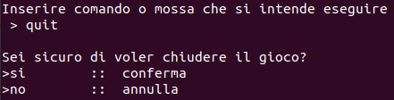
</center>

  > - (il sistema non accetta più altri comandi e termina)
_______________
#### 4) MOSTRARE LA SCACCHIERA
  ***Scopo:*** permettere la visualizzazione a schermo (da CLI) della scacchiera nello stato attuale
  ##### CRITERI DI ACCETTAZIONE
  - eseguendo il comando  
  	[ ***>board*** ]  
  - l'applicazione stampa a video la posizione sulla scacchiera
  
  <center>
	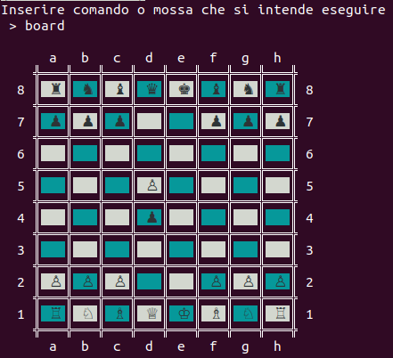
</center>

  > - ogni pezzo è visualizzato con posizione aggiornata all'ultima mossa inserita  
  > - i pezzi sono visualizzati in formato [*Unicode*](https://en.wikipedia.org/wiki/Chess_symbols_in_Unicode)
_______________
#### 5) MUOVERE UN PEDONE
  ***Scopo:*** permettere il movimento del pezzo *pedone* sulla scacchiera
  ##### CRITERI DI ACCETTAZIONE
  - scrivendo il comando in notazione algebrica abbreviata degli scacchi in italiano  
  	- la mossa deve essere legale
  	- se si tenta una mossa non valida viene visualizzato un messaggio *mossa illegale* e l'applicazione rimane in attesa di una mossa valida  
  - la mossa deve essere scritta come  
  	[**nome pezzo**] + [**casella di arrivo sulla scacchiera**] + [**simbolo speciale**]  
  - dove:    
  	- [***nome pezzo***] è una lettera riportata nella tabella qui sotto (nel caso dei pedoni non viene utilizzata nessuna lettera)  
  	- [***casella di arrivo sulla scacchiera***] è un combinazione lettera+numero (id colonna + id riga) [>*chessboard*](https://upload.wikimedia.org/wikipedia/commons/5/51/AlgebraicNotationOnChessboard.png)  
  	- [***simbolo speciale***] è uno dei simbolo utilizzati per evidenziare il verificarsi di un evento particolare (*scacco*, *scacco matto*, *promozione*, *cattura*, *...*)  
  
| `nome pezzo` | Re  | Donna | Torre | Alfiere | Cavallo |
|--------------|-----|-------|-------|---------|---------|
| simbolo      | ♔ ♚ | ♕ ♛ | ♖ ♜ | ♗ ♝ | ♘ ♞ |
| lettera ITA  | R   | D     | T     | A       | C       |
| lettera ENG  | K   | Q     | R     | B       | N       |

| `eventi` | scacco | scacco doppio | cattura | arrocco corto | arrocco lungo | presa en passant | scacco matto |
|----------|--------|---------------|---------|---------------|---------------|------------------|:------------:|
| simbolo  | +      | ++            | x       | 0-0           | 0-0-0         | e.p.             | #            |

<center>
	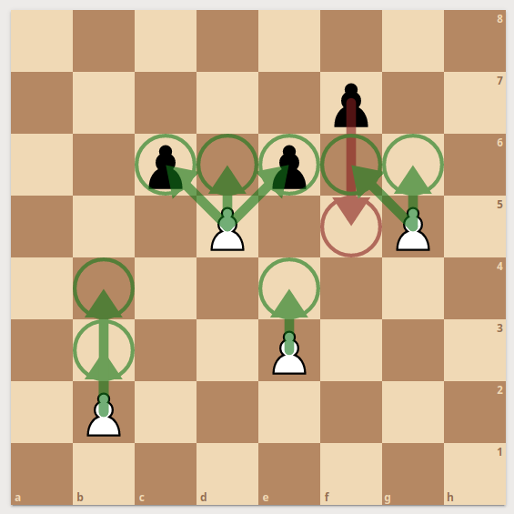
</center>

 > - ***movimento del pedone***
 >    - il pedone può muoversi solo di una casa in avanti, tolta la possibilità di avanzare di due case solo dalla posizione iniziale   
 >    - può catturare i pezzi avversari che si trovano in una delle due caselle oblique a lui adiacenti (a eccezione della presa [en passant](https://lh3.googleusercontent.com/proxy/HdFbE8mPf0x5pYtg7hqGuf2lYdxeZZWUVjgbkjy3ofzEqL_EHpY7zvgWleUN-oAH7ZcafKkFByJezfbaukukb97P0wPq7pWUZo0b0xoA2jBXSSWRv4vT6SBDRgf1UsJOzmRAKghF)): è quindi l'unico pezzo che mangia in modo diverso dal proprio normale movimento  
 >    - se un pedone riesce a raggiungere il lato opposto della scacchiera, il proprietario del pedone lo deve promuovere sostituendolo con un qualsiasi altro pezzo a sua scelta (purché dello stesso colore, e che non sia il re)
_______________
#### 6) MOSTRARE MOSSE GIOCATE
  ***Scopo:*** permettere di visualizzare lo storico delle mosse giocate
  ##### CRITERI DI ACCETTAZIONE
  - eseguendo il comando  
  	[ ***>moves***]  
  - l'applicazione mostra la storia delle mosse compiute fino a quel momento
  
  <center>
	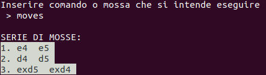
</center>

  > - le mosse sono visualizzate in notazione algebrica abbreviata in italiano
_______________
#### 7) VISUALIZZARE LE CATTURE
  ***Scopo:*** permettere di visualizzare a video i pezzi catturati nel corso della partita
  ##### CRITERI DI ACCETTAZIONE
  - eseguendo il comando  
  	[***>captures***]  
  - l'applicazione mostra tutte le catture della partita in corso fino a qual momento
  
  <center>
	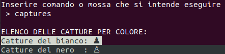
</center>

  > - mostrare le catture del Bianco e del Nero in caratteri Unicode
_______________
#### ***>>>>> [SPRINT 2] user stories <<<<<***
_______________

#### 1) MUOVERE UN CAVALLO
  ***Scopo:*** permettere il movimento del pezzo *cavallo* sulla scacchiera
  ##### CRITERI DI ACCETTAZIONE
  - scrivendo il comando in notazione algebrica abbreviata degli scacchi in italiano  
  	- la mossa deve essere legale
  	- se si tenta una mossa non valida viene visualizzato un messaggio *mossa illegale* e l'applicazione rimane in attesa di una mossa valida  
  	- la mossa deve essere preceduta da una 'C' 
  
<center>
	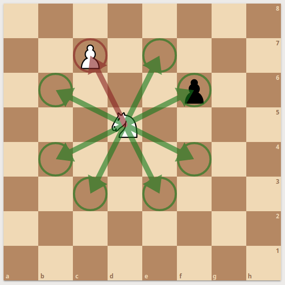
</center>

 > - ***movimento del cavallo***
 >    - il *Cavallo* si muove e cattura alternativamente su case bianche e case nere
 >    - ogni mossa può essere descritta come due passi in orizzontale (verticale) seguito da un passo in verticale (orizzontale), in modo che il tragitto percorso formi idealmente una "L"
 >    - il *Cavallo* è l'unico pezzo presente sulla scacchiera a cui è permesso "saltare" i pezzi, sia alleati, sia avversari 
 >    - l'unico dietro i pedoni che all'inizio può essere mosso senza bisogno di spostare prima questi ultimi
_______________
#### 2) MUOVERE UN ALFIERE
  ***Scopo:*** permettere il movimento del pezzo *alfiere* sulla scacchiera
  ##### CRITERI DI ACCETTAZIONE
  - scrivendo il comando in notazione algebrica abbreviata degli scacchi in italiano  
  	- la mossa deve essere legale
  	- se si tenta una mossa non valida viene visualizzato un messaggio *mossa illegale* e l'applicazione rimane in attesa di una mossa valida  
  	- la mossa deve essere preceduta da una 'A' 
  
<center>
	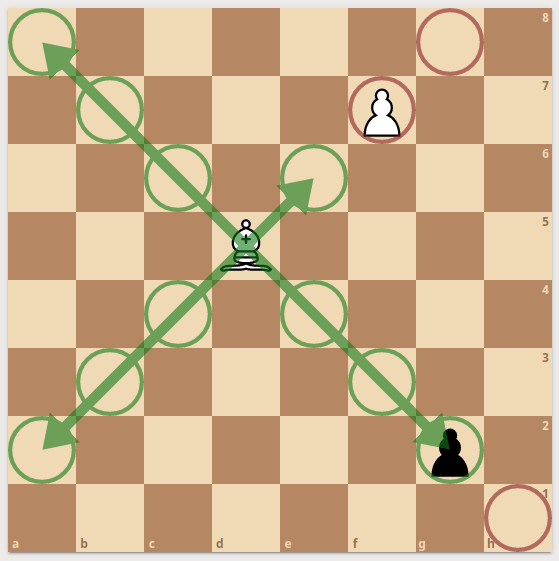
</center>

 > - ***movimento dell'alfiere***
 >    - l'*Alfiere* si muove diagonalmente per il numero di caselle libere che ha a disposizione
 >    - l'*Alfiere* è l'unico pezzo che non può cambiare il colore delle case su cui si appoggia nei suoi movimenti in diagonale
_______________
#### 3) MUOVERE UNA TORRE
  ***Scopo:*** permettere il movimento del pezzo *torre* sulla scacchiera
  ##### CRITERI DI ACCETTAZIONE
  - scrivendo il comando in notazione algebrica abbreviata degli scacchi in italiano  
  	- la mossa deve essere legale
  	- se si tenta una mossa non valida viene visualizzato un messaggio *mossa illegale* e l'applicazione rimane in attesa di una mossa valida  
  	- la mossa deve essere preceduta da una 'T' 
  
<center>
	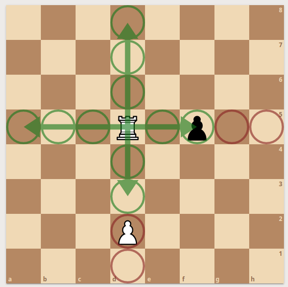
</center>

 > - ***movimento della torre***
 >    - la *Torre* si muove sia orizzontalmente sia verticalmente per il numero di caselle libere che ha a disposizione
 >    - in congiunzione con il *Re*, può eseguire la mossa dell'arrocco
_______________
#### 4) MUOVERE LA DONNA
 ***Scopo:*** permettere il movimento del pezzo *donna* sulla scacchiera
  ##### CRITERI DI ACCETTAZIONE
  - scrivendo il comando in notazione algebrica abbreviata degli scacchi in italiano  
  	- la mossa deve essere legale
  	- se si tenta una mossa non valida viene visualizzato un messaggio *mossa illegale* e l'applicazione rimane in attesa di una mossa valida  
  	- la mossa deve essere preceduta da una 'D' 
  
<center>
	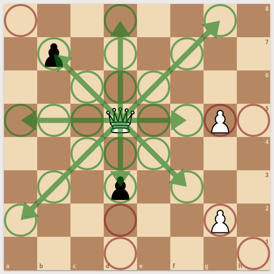
</center>

 > - ***movimento della donna***
 >    - la *Donna* si può muovere in linee rette verticalmente, orizzontalmente o in diagonale per il numero di case non occupate che trova
 >    - combina dunque le mosse della torre e dell'alfiere
_______________
#### 5) MUOVERE IL RE
 ***Scopo:*** permettere il movimento del pezzo *re* sulla scacchiera
 ##### CRITERI DI ACCETTAZIONE
 - scrivendo il comando in notazione algebrica abbreviata degli scacchi in italiano  
 	- la mossa deve essere legale
  	- se si tenta una mossa non valida viene visualizzato un messaggio *mossa illegale* e l'applicazione rimane in attesa di una mossa valida  
  	- la mossa deve essere preceduta da una 'R' 
  	- il *Re* non può muoversi in case minacciate da pezzi avversari 
  	- il *Re* può catturare pezzi avversari
	- nessun pezzo amico deve permettere di "scoprire" il *Re* con la propria mossa
  
<center>
	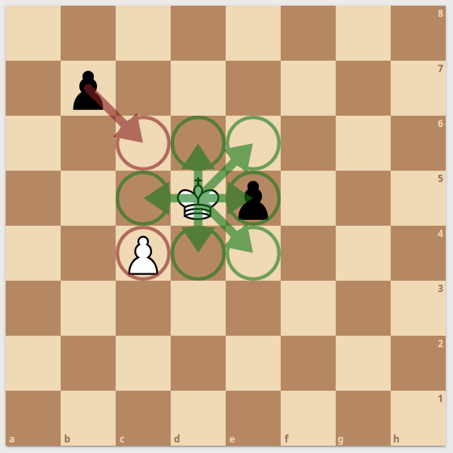
</center>

 > - ***movimento del re***
 >    - il *Re* può muoversi di una casa alla volta in qualsiasi direzione (verticale, orizzontale o diagonale) a condizione che la casa di arrivo non sia minacciata da un pezzo avversario
 >    - in congiunzione con la *Torre*, può eseguire la mossa dell'arrocco
_______________
#### 6) EFFETTUARE UN ARROCCO CORTO
  ***Scopo:*** permettere l'esecuzione di un arrocco corto
  ##### CRITERI DI ACCETTAZIONE
  - scrivendo il comando '0-0' in notazione algebrica abbreviata degli scacchi
  	- il giocatore non deve aver mai mosso il *Re*
  	- il giocatore non deve aver mai mosso la *Torre* coinvolta nell'arrocco corto (deve quindi essere in un angolo di destra della scacchiera) 
  	- non ci devono essere pezzi tra il *Re* e la *Torre* coinvolta, né amici né avversari 
  	- il *Re* non deve essere minacciato 
  	- il *Re*, durante il movimento dell'arrocco, non deve attraversare caselle in cui si troverebbe sotto *scacco* 
  
<center>
	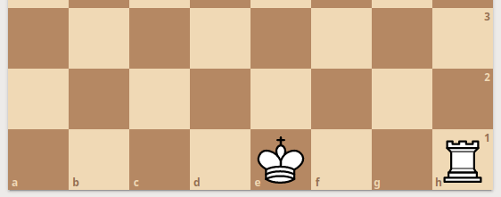
</center>

<center>
	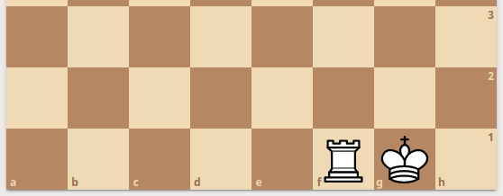
</center>

 > - ***definizione di arrocco corto***
 >    - l'arrocco è effettuato sull'ala di *Re* (sulla destra della scacchiera)
 >    - [***per il Bianco***] il *Re* da **e1** muove in **g1**, la *Torre* da **h1** muove in **f1**
 >    - [***per il Nero***] il *Re* da **e8** muove in **g8**, la *Torre* da **h8** muove in **f8**
_______________
#### 7) EFFETTUARE UN ARROCCO LUNGO
  ***Scopo:*** permettere l'esecuzione di un arrocco lungo
  ##### CRITERI DI ACCETTAZIONE
  - scrivendo il comando '0-0-0' in notazione algebrica abbreviata degli scacchi
  	- il giocatore non deve aver mai mosso il *Re*
  	- il giocatore non deve aver mai mosso la *Torre* coinvolta nell'arrocco lungo (deve quindi essere in un angolo di sinistra della scacchiera) 
  	- non ci devono essere pezzi tra il *Re* e la *Torre* coinvolta, né amici né avversari 
  	- il *Re* non deve essere minacciato 
  	- il *Re*, durante il movimento dell'arrocco, non deve attraversare caselle in cui si troverebbe sotto *scacco* 
  
<center>
	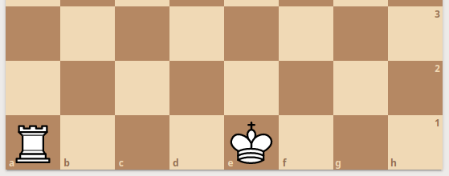
</center>

<center>
	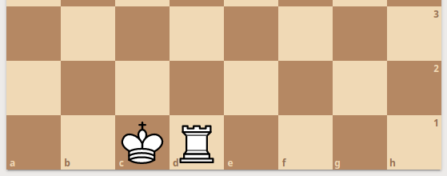
</center>

 > - ***definizione di arrocco lungo***
 >    - l'arrocco è effettuato sull'ala di *Donna* (sulla sinistra della scacchiera)
 >    - [***per il Bianco***] il *Re* da **e1** muove in **c1**, la *Torre* da **a1** muove in **d1**
 >    - [***per il Nero***] il *Re* da **e8** muove in **c8**, la *Torre* da **a8** muove in **d8**
_______________

<br> <br>
[Torna all'indice...](#Indice)

# System Design

### Stile architetturale adottato

~~Lo stile architetturale adottato segue il pattern del <a href="https://en.wikipedia.org/wiki/Model–view–presenter">*Model View Presenter*</a>.~~

~~Infatti lo stile MVP è uno stile adatto per i sistemi interattivi, in cui c'è una netta separazione tra la logica di presentazione dei dati *(View)*  e la logica di business *(Model)*.<br>
Di conseguenza si nota un'indipendenza tra le tre grandi componenti che sono alla base di questo pattern.~~

~~I tre componenti principali sono:
* **Model** : Gestisce i metodi per l'accesso ai dati. Il model nel *MVP* non comunica direttamente con *view* e non si preoccupa di come i dati vengono rappresentati, ma comunica direttamente con il *presenter*.<br>~~
~~Nella nostra applicazione SOQuery e QueryResult lavorano sul *model*.<br>
Nello specifico *SOQuery* si occupa del recupero dei dati tramite l'interazione con l' API GoogleBigQuery, mentre *QueryResult* specifica come i dati vengono rappresentati all'interno dell'applicazione.~~

~~* **View** : Permette la rappresentazione visuale dei dati (sono previste viste multiple) e fornisce una prima interfaccia con l'utente. La view non ha informazione sulla gestione dei dati, ma si occupa solo di rappresentarli. Infatti non ha una comunicazione diretta con il *model* ma ottiene le informazioni necessarie sui dati direttamente del *presenter*.<br>
Nel nostra caso l'interazione tra l'utente e l'applicazione è caratterizzata dall'utilizzo di un interfaccia di tipo *CLI* (*<a href="https://it.wikipedia.org/wiki/Interfaccia_a_riga_di_comando">Command Line Interface</a>*) .<br>
I dati vengono visualizzati su un foglio elettronico generato da *Google API Services Sheets* e condiviso da *Google API Services Drive*.~~

~~* **Presenter** : Gestisce la sequenza delle interazioni tra l'applicazione e l'utente, facendo controlli sull'input e fornendo comandi per il *modello* o la *vista*.
A differenza del <a href="https://it.wikipedia.org/wiki/Model-view-controller">*Model View Controller*</a> dove è presente il *controller*, nel *MVP* la presenza del *Presenter* garantisce la totale separazione tra il modello e le viste.<br>
Infatti il Model non notifica eventi alle viste.
Nell'applicazione le componenti che si occupano di gestire le sequenze di interazioni sono *Parser, Arguments, Query* e *GoogleDocsUtils.*<br>
*Parser* si occupa di analizzare sintatticamente il comando fornito in input dall'utente e inserisce i dati un oggetto di tipo "Arguments".
<br>*Arguments* contiene i parametri scritti dall'utente per costruire la query.
<br>*Query* in base ai parametri forniti da Arguments genera la query associata al comando.
<br>*GoogleDocsUtils* scrive i risultati delle query nel foglio elettronico che poi verrà visualizzato dell'utente.~~

<br>
  
<br>

~~*Il nostro MVP non è da ritenersi completamente puro, poichè non è presente una GUI (<a href="https://it.wikipedia.org/wiki/Interfaccia_grafica">Graphical User Interface</a>) e quindi in questo caso le componenti view hanno un ruolo minimale.*~~

### Diagramma dei package

<br>
  
<br>

### Diagramma dei componenti

<br>
  
<br>

### <a name="Commenti-SD"></a>Commenti delle decisioni prese

~~Inizialmente avevamo pensato di adottare come stile architetturale il *"Pipe and filter"*, ma notando che c'era un interazione frequente con le API di Google e che più volte si comunicava con gli stessi sottosistemi esterni abbiamo optato per utilizzare il *Model-View-Presenter* (**MVP**).<br>
Infatti lo stile MVP è adatto per i sistemi interattivi, in cui c'è una netta separazione tra le varie componenti del sistema che però comunicano frequentemente tra di loro.~~

<br><br>
[Torna all'indice...](#Indice)

# OO Design
### <a name="Diagrammi-delle-classi-e-diagrammi-di-sequenza"></a> Diagrammi delle classi e diagrammi di sequenza

* Di seguito viene presentato il diagramma delle classi ...

<center>
	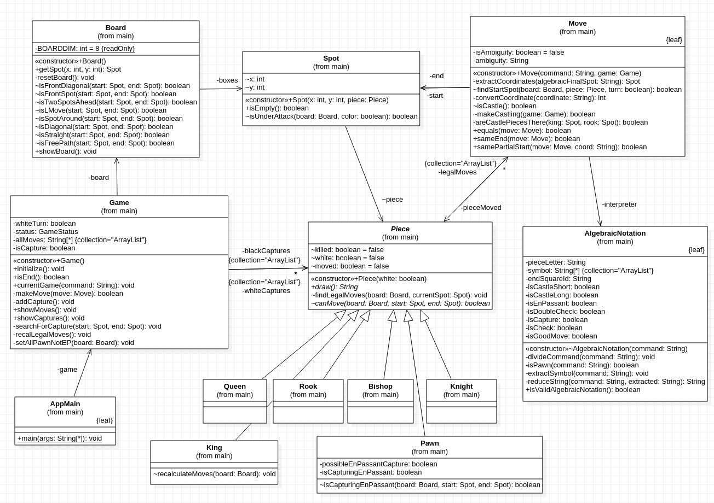
</center>

<br> <br>

... il diagramma di sequenza relativo alla user story 5 dello sprint 1 ...

<center>
	
</center>

<br> <br>

... e il diagramma di sequenza relativo alla user story 6 dello sprint 2.

<center>
	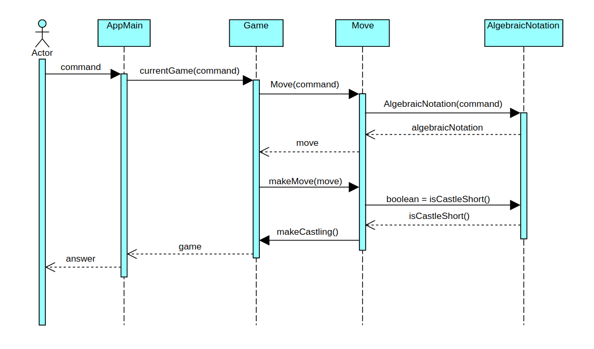
</center>

<br> <br>

<a name="Design-pattern-utilizzati"></a>

### Design patterns
  Il primo design pattern utilizzato è quello dell'iterator. La classe **QueryResults**, che modella il risultato di una query, estende la classe *Iterable*. Pertanto gli oggetti istanziati dalla classe **QueryResults** sono iterabili lungo le righe della tabella risultante dall'esecuzione di una query.
  <br>
  Il secondo (ma più importante) design pattern utilizzato è quello del [**Builder**](https://it.wikipedia.org/wiki/Builder). E' stata definita una interfaccia chiamata **IQueryBuilder** che modella le operazioni che ogni costruttore (builder) di query deve avere, e sono:
* *IQueryBuilder buildSelect()*
* *IQueryBuilder buildTable()*
* *IQueryBuilder buildWhere()*
* *IQueryBuilder buildGroupBy()*
* *IQueryBuilder buildOrderBy()*
* *IQueryBuilder buildLimit()*
* *QueryTable getResult()*

La classe **QueryDirector** al momento dell'istanziazione, in base ai parametri passati in input (di classe **Arguments**) istanzia una classe concreta che implementa **IQueryBuilder**. Le classi concrete tutt'ora implementate sono:
* *QueryBuilderUserID*: responsabile di costruire le query che interrogano il database sugli user id;
* *QueryBuilderUserIDTaglike*: analogo a *QueryBuilderUserID* ma filtra anche in base al tag;
* *QueryBuilderEdge*: responsabile di costruire le query che interrogano il database sulle relazioni tra utenti;
* *QueryBuilderEdgeWeight*: analogo a *QueryBuilderEdge* ma che si occupa anche di interrogare il database sul numero di relazioni tra utenti.

Quando viene chiamato il metodo **construct()** di **QueryDirector**, esso demanda al builder astratto di costruire la query. Dopodichè è possibile ottenere la query come stringa chiamando il metodo **getQuery()** di **QueryDirector**.

Il terzo design pattern utilizzato, associato al design pattern del **Builder** è quello del [fluent-interface](https://en.wikipedia.org/wiki/Fluent_interface). Sostanzialmente ogni operazione che **IQueryBuilder** possiede ha come valore di ritorno un oggetto d'istanza di una classe che implementa l'interfaccia **IQueryBuilder**. Questo permette di concatenare i metodi per la costruzione della query "a cascata". Ad esempio:
~~~java
query = builder.buildSelect()
	.buildTable()
	.buildWhere()
	.buildGroupBy()
	.buildOrderBy()
	.buildLimit()
	.getResult();
~~~

L'ultimo design pattern utilizzato è quello del **Singleton**. La classe **Parser**, infatti, non è istanziabile direttamente, ma è presente un'unica istanza per tutto il programma.

<a name="Commenti-OO"></a>

### Commenti

~~Il design pattern dell'iterator rappresenta un modo semplice ed intuitivo per ciclare lungo le tuple del risultato dell'esecuzione della query, mentre il design pattern del builder consente di estendere il codice anche per altre future tipologie di query, semplicemente implementando l'interfaccia **IQueryBuilder** e modificando il costruttore della classe **QueryDirector**. Inoltre il design pattern del fluent-interface rende il codice più leggibile e coinciso.~~

~~***N.B.***: C'è un unico diagramma delle classi perchè sarebbe stato ridondante riportarne due identici.~~

<br><br>
[Torna all'indice...](#Indice)

# Riepilogo del test

<br>


<br><br>
[Torna all'indice...](#Indice)

# Manuale utente

*Requisiti di sistema per l'app Scacchi

Elenco dei terminali supportati su cui poter eseguire il container dell'app scacchi:

Linux:  
	terminal  
Mac OS:  
	terminal  
Windows:  
	-Windows Terminal (preview)  
	-Terminal del sottosistema Windows per Linux  
	-Git Bash (in questo caso il comando Docker ha come prefisso winpty; es: winpty docker -it ....)  


*Esecuzione via Docker attraverso il comando:
```
docker run -it --rm docker.pkg.github.com/softeng1920-inf-uniba/docker_1920/wilkinson:latest
```


* `play` consente di iniziare una nuova partita e offre questi altri comandi:
   - comando: dove per "comando" si intende una stringa valida in notazione algebrica
   - `board`: mostra la scacchiera con la configurazione dei pezzi attuale
   - `moves`: mostra in notazione algebrica tutti i movimenti eseguiti finora
   - `captures`: mostra tutte le catture avvenute fino al momento in cui viene eseguito il comando
   - `help`: mostra i comandi disponibili per l'applicazione
   - `play`: consente di interrompere la partita in corso, e inizarne una nuova
   - `quit`: permette all'utente di abbandonare la partita in corso

* Al termine di ogni esecuzione di sna4so (output):
  - i risultati di una query sono salvati in un Google Spreedsheet attraverso le relative API
  - l'applicazione stampa a console l'url per acceddere via web a tale foglio di calcolo
  - il foglio di calcolo è accessibile in lettura a chiunque abbia il link
  - il foglio di calcolo può essere salvato in locale in formato CSV

<br> <br>
[Torna all'indice...](#Indice)

# Processo di sviluppo e organizzazione del lavoro
Il processo di sviluppo di **SCACCHI** ha seguito un approccio di tipo [***SCRUM***](https://it.wikipedia.org/wiki/Scrum_%28informatica%29), con alcune modifiche.
Lo sviluppo dell'applicazione ha previsto tre sprint di diversa durata. 
  - Il Professore ha ricoperto, a seconda delle necessità e per fini didattici, il ruolo del **Product Owner**, assumendosi la responsabilità della gestione del Product Backlog, e quello dello **Scrum Master**, fornendo aiuto a capire le regole, la teoria ed i valori di Scrum. 
  Prima dell'inizio di ogni sprint, ci sono stati comunicati  gli obiettivi da realizzare, e le loro priorità, attraverso i concetti di *User Stories* e *Definition of Done*.
  Sono state previste delle board per ogni sprint, ed una board generale di **Product Backlog** in cui è stato elencato tutto il lavoro da fare in futuro, sotto forma di *User Story*.
  Le priorità sono quindi state definite dal Product Owner, e le storie associate, hanno fatto parte della *Sprint Board* di ogni sprint.
  <br> <br>
  - L'obiettivo del team da raggiungere alla fine di ogni sprint, detto **Sprint Goal**, è stato dettato, dalla *Definition of Done*, una lista contenente le user story da portare a termine, per considerare lo sprint compiuto. 
  <br> <br>
  - Ogni *Sprint board* è stata rappresentata tramite una board virtuale su [**GitHub**](https://github.com/), organizzata in stile [*Kanban*](https://it.wikipedia.org/wiki/Kanban) secondo questo critetrio:   
  <br> <br>
    - **TO DO**, compiti non ancora svolti
    - **IN PROGRESS**, compiti in svolgimento
    - **REVIEW**, compiti in attesa di *build* di *GitHub Actions* e revisione di almeno un componente del team
    - **READY**, compiti svolti ma in attesa di revisione da parte dei Professori
    - **DONE**, compiti svolti che non necessitano di ulteriore revisione
  <br> <br>
  - Come gruppo ci siamo auto-organizzati ed abbiamo gestito in autonomia la suddivisione del lavoro. I vari componenti hanno affrontato le varie problematiche da affrontare con flessibilità ma sempre con responsabilità nei confronti del lavoro da svolgere e nei confronti degli altri componenti del gruppo.
  <br> <br>
  - La gestione dello sviluppo è stato coordinato attraverso il **GitHub Flow**: <br>
    il lavoro da svolgere è stato rappresentato da diverse *Issue*, ogni issue è stato assegnato ad almeno un membro del gruppo, ed è stata associata ad un *branch* sul quale sviluppare il software necessario.
    Alla fine dello sviluppo necessario per un *Issue*, il contenuto del *branch* è stato testato e sottoposto alla review degli altri componenti del gruppo tramite una *pull request*. Solo quando il team ha approvato il software associato all'issue in pull request, il branch è stato inserito all'interno del branch *master* attraverso un'operazione di *merge*, previa risoluzione di eventuali conflitti.
  <br> <br>
  - I **Daily Meeting** sono avvenuti quotidianamente su [**Microsoft Teams**](https://www.microsoft.com/it-it/microsoft-365/microsoft-teams/free?market=it), per via dell'impossibilità di incontrarsi di persona, dettata dalla diffusione del virus SARS-CoV-2. Anche alcune sessioni di sviluppo sono avvenute tramite Microsoft Teams, che è risultato molto utile grazie agli strumenti di condivisione dello schermo, e alla [**Whiteboard**](https://www.microsoft.com/it-it/microsoft-365/microsoft-whiteboard/digital-whiteboard-app) associata.

<br> <br>
[Torna all'indice...](#Indice)

# Analisi retrospettiva
- ### Soddisfazioni
    La comunicazione e la puntualità dei membri del gruppo è stata senza dubbio un segnale di maturità e motivazione. I contatti tra di noi sono stati molto costruttivi, gli scambi di idee e i consigli hanno permesso ad ogni membro del team di imparare qualcosa da un altro membro. Questo ha permesso durante l'arco della durata del progetto, ad ogni membro del team di impare qualcosa di nuovo ed utile, oltre che a migliorare l'uso delle metodologie di svilippo AGILE.
    <br> <br>
    Gli strumenti [**GitHub**](https://github.com/) e [**Git**](https://git-scm.com/), inzialmente visti con un certo scetticismo, sono diventati imprescindibili per portare avanti lo sviluppo in team.
    <br> <br>
    Il Daily Scrum Meeting è sempre avvenuto su [**Microsoft Teams**](https://www.microsoft.com/it-it/microsoft-365/microsoft-teams/free?market=it) in virtù della ben nota problematica del nuovo Coronavirus in corso. Il tool di Microsoft si è rivelato molto utile grazie alle sue diverse features.


- ### Insoddisfazioni
    In alcuni casi, oltre al Daily Scrum Meeting, è stato necessario "incontrarci" per poter dialogare e discutere sulle problematiche che via via si sono presentate. Quindi in aggiunta al metodo [**SCRUM**](https://it.wikipedia.org/wiki/Scrum_%28informatica%29) classico, è stato necessario aggiungere delle sessioni di vero e proprio lavoro congiunto che potesse risolvere i nuovi problemi. Queste sessioni però, si sono via via ridotte in quanto ognuno, grazie all'esperienza accumulata durante le sessioni precedenti, è stato in grado di procedere in autonomia, sempre secondo il [**GitHub flow**](https://guides.github.com/introduction/flow/).

- ### Cosa ci ha fatto impazzire

    Lo scoglio più grande dal punto di vista implementativo è stato senza dubbio quello della cattura _en passant_ del pedone, a tal punto che nel gruppo pronunciare questo tipo di cattura è diventato un vero e proprio tabù.~~Nutriamo rancore verso l'IDE [***ECLIPSE***](https://www.eclipse.org/), che sebbene con *Formatter* e *Save Actions* ci abbia evitato molti errori di [**CheckStyle**](https://en.wikipedia.org/wiki/Checkstyle) , ci ha rovinato diversi pomeriggi mostrando errori inesistenti, poi risolti solamente chiudendolo e riaprendolo dopo varie imprecazioni. A volte abbiamo anche dovuto fare un *Clean* per risolvere errori che non avevano motivo di esistere. È stato frustrante soprattutto per alcuni del nostro team doverlo utilizzare, abituati ad un semplice text editor (vedi [**ATOM**](https://atom.io/)) e alla compilazione/esecuzione da riga di comando, anche grazie alla eperienza acquisita nel primo semestre con il prof. [*Nicola Di Mauro*](http://www.di.uniba.it/~ndm/), durante l'insegnamento di [**ASD**](http://www.di.uniba.it/~ndm/courses/asd/)~~


   
<br> <br>
[Torna all'indice...](#Indice)
